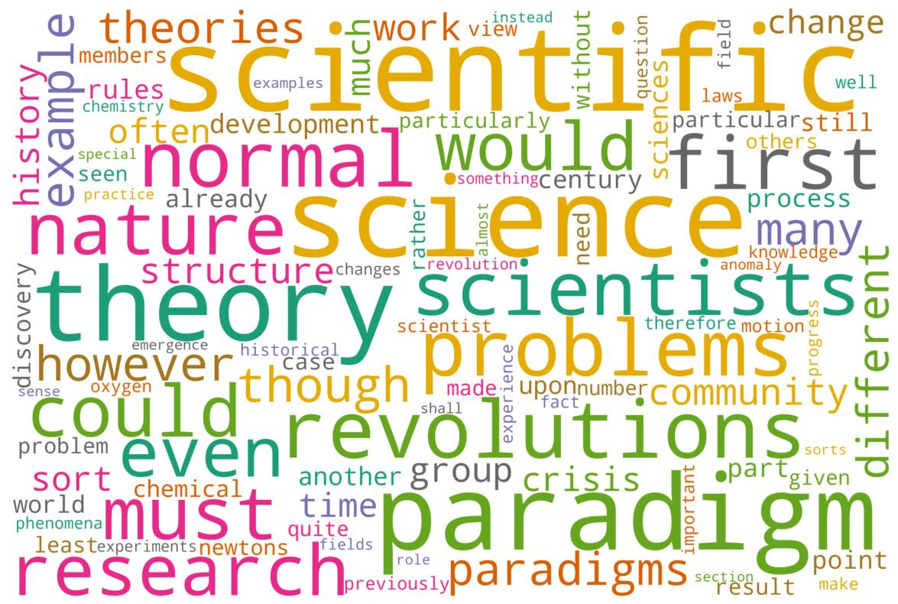

# word_clouds
**Description:** ingests text from pdf(s), processes it, and makes a word cloud(s). These are useful for things like [concept maps][cmaps].
 
 

**Requirements:** 
`PyPDF2, nltk, wordcloud, collection, numpy, pillow, and matplotlib`

## Notebooks
1. make_world_cloud.ipynb -- contains all the code. Results are put in the `results/` folder.  Input pdfs are in `inputs/` folder

## Example Output 
(from Thomas Kuhn's _The Structure of Scientific Revolutions_)
 

## Misc. Links
1. [concept maps repo ideas][cmaps]
2. [word cloud repo](https://github.com/amueller/word_cloud) Note: has cool examples to try 
3. [word cloud website](http://amueller.github.io/word_cloud/)  
4. [datascience article](https://towardsdatascience.com/pdfs-to-word-cloud-in-3-steps-73ccbff6d835) 
5. [tutorial](https://github.com/Lakshmi-1212/wordcloud_from_docs/blob/main/wordcloud_generator.ipynb) Note: old and needs updates 

[cmaps]: https://github.com/dhatm/concept_maps

